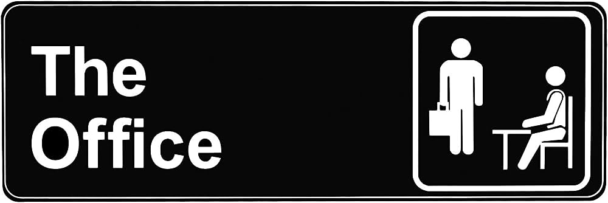
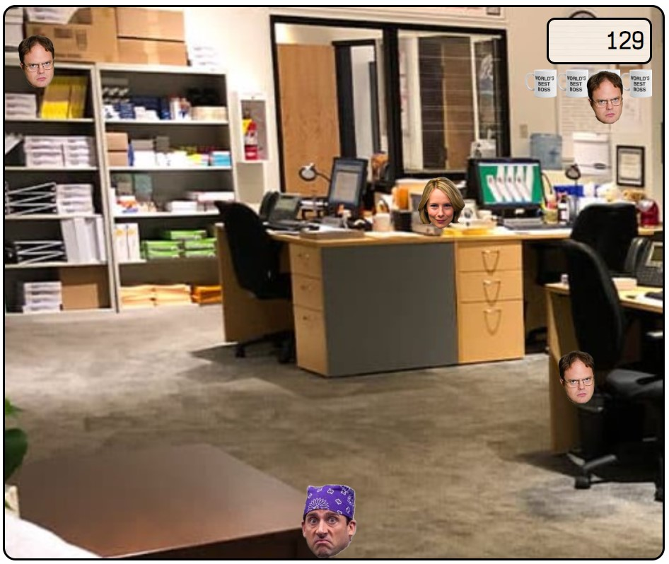
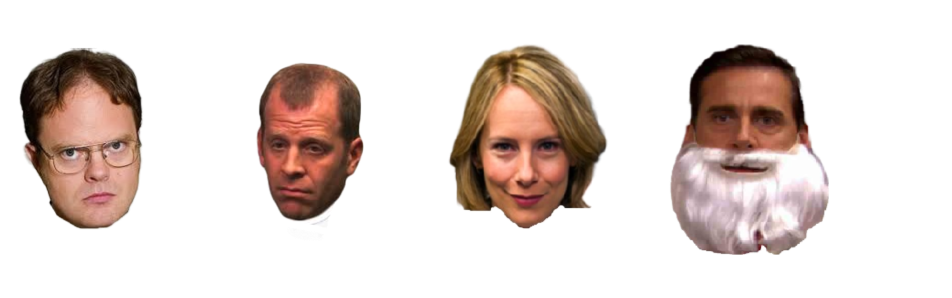

# Project 1 | The Office Game

## Introduction
Everyone has heard of this acclaimed TV show. Its light humour and impeccably curated characters are always fun to watch (and re-watch), and let's not forget the fact that it is the only US version of a British show that dethoned its original version.

Today we bring you this fun and entertaining game so you don't get bored while you are... well, at **the office**. 


## The Game
The 2D game is set in one static screen. There is one player, two different obstacles and two different rewards. The game is not timed or has an ending goal; if you are good and have a lot of free time, you could be playing forever. 

Using the left and right arrow keys, the player will try to catch the rewards and avoid the obstacles. Those in turn will go faster as time goes by and after a certain amount of seconds, the amount of obstacles will also increase, resulting in more difficulty. 



## Structure
Due to the time constraint of the project, the initial objectives *vs* the final result are not the same. At first, the intention of the game was to create a moving player and a moving obstacle, *y punto*; but as the MVP was achieved sooner than expected and the code started shaping up, regular visits to the backlog were made. This is why the structure might not look completely logical, but it is polished and completely readable. 

The project is spread across one HTML file, one CSS file, and three separate JS files. 

### HTML
The **HTML file** is simple and straightforward and contains only the pre-existing elements. The body contains both game and gameover screens with their respective buttons, the player div and the different audios. 
```html
<body>
    <div id="gameScreen">
        <button id="startButton">play me</button>
        <div id="scoreCounter"></div> 
```

These elements are unique and will be present and unchanged during the whole game (the only alterations will be to their display to move from one screen to another). Once the CSS and JS files are linked inside the head and body respectively, the HTML document is ready to go.

### CSS 
The **CSS file** contains 99% of the styles - some are added later using JS for functionality reasons. Besides adding colour and size, CSS is also used to enhance the user experience by adding additional features. Below is an example of the structure that enables the start button to change its background while the mouse is hovering on top of it.

```css
#startButton:hover {
    background-image: url("./images/logo.png");
    background-size: cover;
    background-repeat: no-repeat;
    color: hsla(0, 0%, 100%, 0)
}
```

### JS
The three **JS files** are:
- **player.js**: the simplest of them all, creates the object **Player** and places it within the game screen. Both methods inside this class enable the movement of the player and set the boundaries within the screen.
- **game.js**: the Game class is created and contains most of the information regarding the inner workings of the game. As all the styles have been added in CSS, among other elements this constructor focuses on creating empty arrays where the obstacles and rewards will be added (and deleted from). Here, we can also find the method that will trigger the game over screen as well as a method to keep count of the lives and adds/eliminates the life icons accordingly. 
- **script.js**: this is the biggest file and feeds from both the player and the game ones. To ensure all code is ready to go, it has been written inside a window.unload. 
The main functions in the script are:
    - Starting the game, including a game loop for certain functions to be continuously run rather than once at the beginning.
    - Creating a time and a score counter; the first one will be used to up the speed of the obstacles and hence the difficulty of the game, and the second one will show the score.
    - The player will move by pressing down *right arrow* and *left arrow*, and both start and restart buttons will each trigger some functions. This has been achieved by using eventlisteners. 
    - There are four moving objects and they all share the same core code structure with their own bespoke functionality. 
        - Obstacle 1 | *Dwight Schrute*: -1 life
        - Obstacle 2 | *Toby Flenderson*: lives = 0 (game over)
        - Reward 1 | *Holly Flax*: +100 score
        - Reward 2 | *Michael "Jesus" Scott*: +1 life



*To have a look at the full code, please refer to the files inside the Github.*


## Tools and resources
To create a cohesive and enjoyable experience for the user, lines of code, images and sounds have been combined using various platforms and tools. These are:  
[Github](https://github.com/), [Git](https://git-scm.com/), [Javascript](https://developer.mozilla.org/en-US/docs/Web/JavaScript), [CSS](https://developer.mozilla.org/en-US/docs/Web/CSS), [HTML](https://developer.mozilla.org/en-US/docs/Web/HTML), [DOM manipulation](https://developer.mozilla.org/en-US/docs/Learn/JavaScript/Client-side_web_APIs/Manipulating_documents), [WavePad](https://www.nch.com.au/wavepad/es/index.html?kw=wavepad&gclid=CjwKCAjwq4imBhBQEiwA9Nx1BtQ_JY2jYajBVyySpKumoqlI47nZT1mednkYvTxGq4TQ27KrEcJcAhoCzMsQAvD_BwE) and [Adobe](https://express.adobe.com/sp/onboarding). 


## Personal Opinion
This is my very first project and, despite the obvious lack of complexity and the occasional bug, I could not be any happier with it. A feat that seemed impossible at first was completed not only within the timeline but also exceeding expectations.

It has been equally tough and enjoyable, and will look back at this fondly in the coming years.  

Do have a look at the [game](https://evros13.github.io/project-1-game/) and kill some time if you want! 

Thank you!


